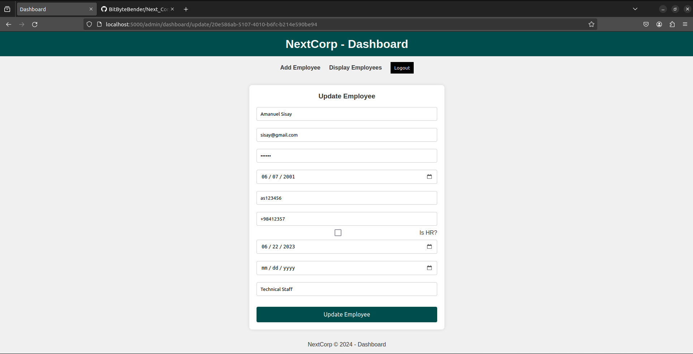

# NextCorp | Your all-in-one small corp manager

__NextCorp -> is an online employee manager system solution for small corps__

# Project Description:
__This Flask-based web application serves as a comprehensive solution for managing employee attendance and corporate user access. The application is built upon a robust MySQL database and SQLAlchemy ORM, providing structured storage for employee data and check-in/out records.__

# Key Features:

> Dual-User Interface:
* A corporate admin dashboard for managing employee records and access.
* A user-friendly employee interface for checking in/out and viewing personal information.

> Authentication and Authorization:
* Distinct login systems for corporate admins and employees.
* Secure authentication mechanisms (password hashing and comparison) to protect user credentials.

> Employee Management (Admin Dashboard):
* Creation of new employee accounts with validation checks.
* Retrieval of employee details, including check-in/out history.
* Updating of employee credentials (name, email, password) and other information.
* Deletion of employee accounts when necessary.

> Employee Profile:
* Allows employees to view and modify their personal information.
* Displays their check-in/out history.

> Check-In/Out Tracking:
* Automatic check-in on employee login and check-out on logout.
* [Hardcoded] 1-minute check-in limit to prevent multiple check-ins within a short time frame.
* Checkout time is updated when the employee logs in or out within 1 minute of their last check-in.

> RESTFUL API:
* Exposes endpoints for both corporate admins, employees and checker system.
* Enables:
  -> Retrieval of employee lists and individual details.
  -> Insertion of new employee records.
  -> Updating of existing employee information.
  -> Deletion of employee records.
  -> Management of check-in/out records (creation, retrieval, updating).

# Project Structure:
> Models:
* Defines the database models using SQLAlchemy to represent employees,
corporations, and check-in/out entries.

> Storage Engine:
* Provides an abstraction layer to interact with the database, handling CRUD (Create, Read, Update, Delete) operations.

> API Views:
*  Implements the API endpoints using Flask's blueprint mechanism to organize the code based on functionality.

> Web Pages:
* Includes Flask blueprints for handling corporate authentication,
employee login/logout, profile management, and the home page.

> Templates:
* Contains HTML templates for rendering different pages of the application.

> Static Assets:
* Includes CSS files for styling and JavaScript files for handling frontend interactions (like => dynamic updates of check-in/out information).

# Technology Stack:
> Python:
* The programming language for the backend logic.
> Flask:
* The web framework for building the application.
> SQLAlchemy:
* The ORM for database interactions.
> MySQL:
* The database system.
> HTML, CSS, JS:
* Technologies used for frontend development.

# Task Manager (Trello Board):
* https://trello.com/invite/b/95awRY6W/ATTI03e890d71d53b89b2469436abe9abf603C79E223/next-corpmvp

# Data Modelling:

# List of functional URL paths/routes:
|      URLs (Active)    |                          Description                                      |
|:---------------------:|:-------------------------------------------------------------------------:|
| corp_auth/register    | Registration path for corps to generate a login unique id.                |
| corp_auth/login       | Login path for corps as admins to access the dashboard.                   |
| /reset?corp_id='{id}' | URL to reset the password for corps.                                      |
| admin/dashboard       | Path to access the dashboard List of employees are displayed by default.  |
| admin/dashboard/add   | URL to access the "Add Employee" functionality from the dashboard.        |
| /update/{employee_id} | URL to access the update functionality on the dashboard (admin/dashboard).|
| /auth/employee_login/ | Path to launch the login for user aka employees.                          |
| /home                 | / or /home or /home/ Paths using auto redirections to the home page.      |
| /profile              | Path to access the profile manager to perform updates or view data.       |

# Project's screenshots:

# Authors:
> Soufiane Sadgali - [Github](https://github.com/BitByteBender)

> Cleveland Ataafi - [Github](https://github.com/thatguykwameC)

> Olatunji Oluwadare - [Github](https://github.com/DevTunechi)
